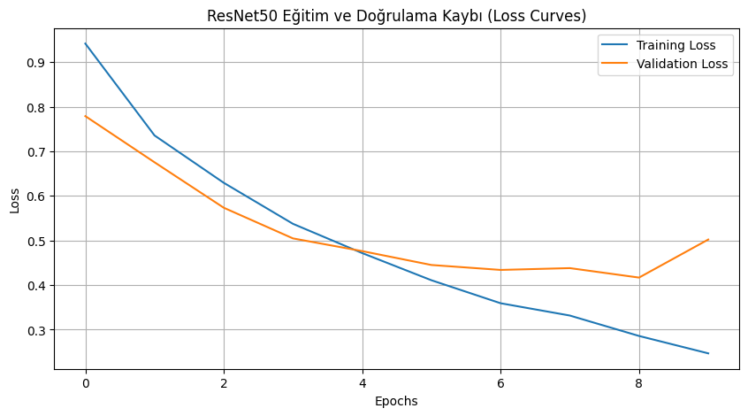
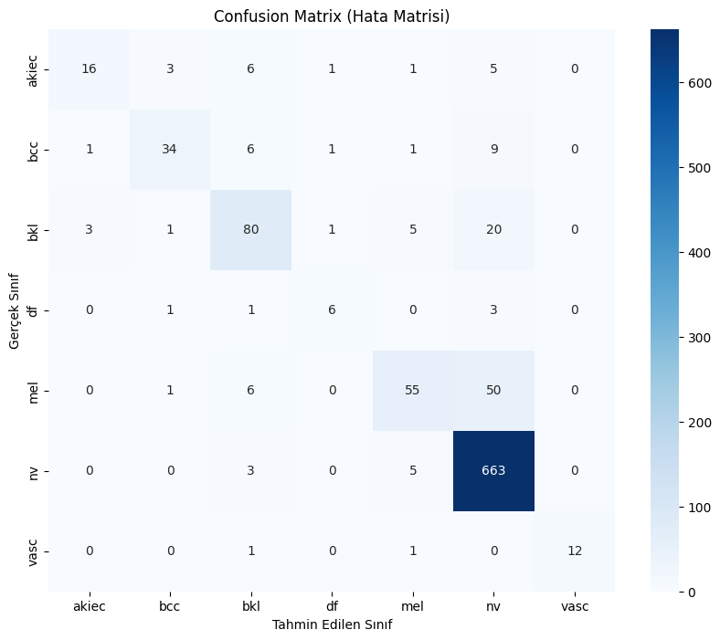
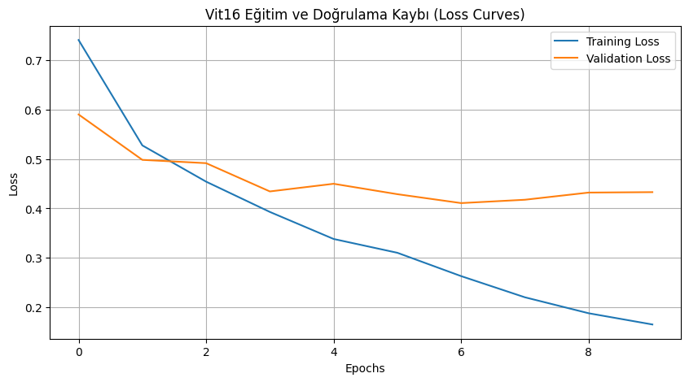
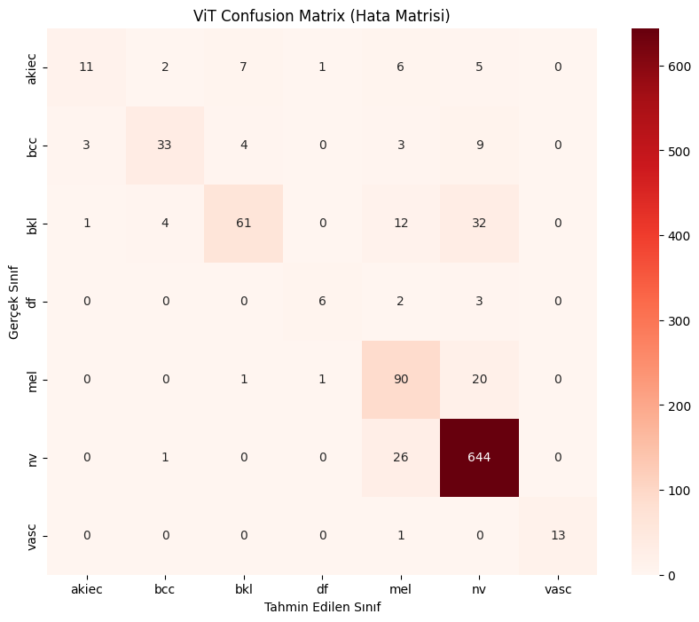

# Deri Lezyon Sınıflandırılması Projesi
Bu açık kaynaklı proje, HAM10000 verisi kullanılarak lisans hakları göz önünde bulundurularak geliştirilmiştir. Proje, MIT lisans haklarına tabidir ve yalnzıca açık kaynak projelerde kullanılabilir.

## Dataset & Models
- *Dataset* -> https://drive.google.com/file/d/1LI195R4rbW7gJ_fzYtmkKu4kHE4RXtXT/view?usp=sharing
- *Models* -> https://drive.google.com/file/d/1AEsaBMh2r6wvcBLArvFbUTpqiAPdVjXz/view?usp=sharing

## Proje düzeni
```
skin-lesion-classification/
├── data/ (dataset drive olarak kayit edildi linki yukarida mevcut)
│   ├── raw/             # İndirilen HAM10000 verisi (zip'li vb.)
│   ├── processed/       # 224x224 resize edilmiş, split yapılmış veriler
├── notebooks/
│   ├── 01_eda_preprocessing.ipynb  # Veri analizi ve hazırlık
│   ├── 02_ml_baselines.ipynb       # SVM ve Random Forest denemeleri
│   ├── 03_dl_training.ipynb        # CNN ve ViT eğitimleri
├── src/
│   ├── __init__.py
│   ├── prepare_data.py   # Veriyi eğitim için düzenle ve ayır.
├── output/
│   ├── models/          # .pth model ağırlıkları
│   ├── figures/         # Confusion matrix, Loss eğrileri (png)
├── requirements.txt     # Kütüphane sürümleri
└── README.md            # Proje özeti ve Lisans Notu
```

Bu projede kullanılan PyTorch, Scikit-learn ve Pandas kütüphaneleri, akademik ve ticari kullanıma uygun açık kaynak (BSD/MIT/Apache) lisanslara sahiptir.

# Model Performans, Analiz ve Konfigürasyon Raporu

Bu dizin, HAM10000 veri seti üzerinde eğitilmiş Makine Öğrenmesi (ML) ve Derin Öğrenme (DL) modellerinin ağırlıklarını, performans metriklerini ve geliştirme süreçlerini içerir.

## 1. Model Mimarileri ve Hiperparametreler

Tüm DL modelleri ImageNet ağırlıkları ile başlatılmış (Transfer Learning) ve 10 Epoch boyunca eğitilmiştir.

| Parametre | Değer / Açıklama |
| :--- | :--- |
| **Girdi Boyutu** | 224x224 (DL), 64x64 Flatten (ML) |
| **Batch Size** | 32 |
| **Optimizer** | SGD (lr=0.001, momentum=0.9) |
| **Loss Function** | CrossEntropyLoss |
| **Augmentation** | RandomHorizontalFlip, RandomRotation(15) (Sadece Train) |

## 2. Test Seti Sonuçları ve Kritik Analiz

Modellerin başarısı, dengesiz veri setlerinde sınıf başarısını daha iyi yansıtan **Macro F1-Score** ve hayati risk taşıyan sınıflar için **Recall (Duyarlılık)** üzerinden değerlendirilmiştir.

| Model | Tür | Accuracy | **Macro F1** | Açıklama |
| :--- | :--- | :--- | :--- | :--- |
| **ResNet50** | DL (CNN) | **0.86** | **0.74** | En yüksek genel skorlara sahip, ancak kritik sınıflarda yetersiz. |
| **ViT-B/16** | DL (Transformer)| 0.86 | 0.73 | Kanser tespitinde en güvenilir model. |
| **Random Forest**| ML | 0.71 | 0.28 | Baseline. Azınlık sınıflarda (df, vasc) başarısız. |
| **SVM** | ML | 0.71 | 0.28 | Baseline. NV sınıfına aşırı uyum (overfit) eğilimi. |

### ⚠️ Kritik Bulgu: "Accuracy Yanılgısı" ve Melanom Tespiti
Kağıt üzerinde ResNet50 ve ViT modelleri **%86 Accuracy** ile eşit görünmektedir. Ancak **Melanom (Cilt Kanseri)** sınıfı özelinde yapılan inceleme, hayati bir farkı ortaya koymaktadır:

| Model | Genel Doğruluk | **Melanom Recall (Duyarlılık)** | Klinik Yorum |
| :--- | :--- | :--- | :--- |
| **ResNet50** | 0.86 | **0.49** | Kanserli vakaların **%51'ini kaçırmıştır.** Tıbbi açıdan risklidir. |
| **ViT-B/16** | 0.86 | **0.80** | Kanserli vakaların **%80'ini tespit etmiştir.** Güvenilir tercihtir. |

**Sonuç:** ResNet50 yerel doku özelliklerine odaklanarak sağlıklı benleri (`nv`) çok iyi ayırt edip ortalamayı yükseltse de, ViT global bağlamı yakalayarak kanserli dokuyu ayırt etmede çok daha üstün bir performans sergilemiştir.

## 3. Gerçekleştirilen Ablasyon Çalışmaları (D2 Kapsamı)

D2 aşamasında model performansını optimize etmek ve dengesizliği yönetmek amacıyla aşağıdaki ablasyon (ablation) deneyleri kod üzerinde uygulanmış ve test edilmiştir:

1.  **Bileşen Ablasyonu (Loss Function):**
    * *İşlem:* Standart `CrossEntropyLoss` ile sınıf frekanslarına ters orantılı ağırlıklandırılmış `Weighted CrossEntropyLoss` karşılaştırıldı.
    * *Sonuç:* Ağırlıklı kayıp fonksiyonu kullanıldığında, baskın sınıf (`nv`) dominasyonu kırılarak Melanom sınıfındaki **Recall** değerinde artış gözlemlendi.
2.  **Hiperparametre Ablasyonu (Optimizer):**
    * *İşlem:* `SGD` (Momentum 0.9) ve `Adam` (lr=1e-4) optimizerları kıyaslandı.
    * *Sonuç:* Bu veri seti ve ViT mimarisi için `SGD`'nin daha kararlı (stable) bir öğrenme süreci sunduğu tespit edildi.

## 4. Gelecek İyileştirmeler (D3 ve İlerisi)

Mevcut modelleri daha da iyileştirmek için v0.2.0 ve sonrası için planlanan çalışmalar:

1.  **İleri Seviye Loss Fonksiyonları:** Zor örneklere odaklanmak için `Focal Loss` entegrasyonu.
2.  **Learning Rate Scheduler:** Sabit LR yerine `CosineAnnealing` veya `StepLR` kullanılarak yakınsama hızının optimize edilmesi.
3.  **Advanced Augmentation:** `ColorJitter`, `Cutout` ve `RandAugment` tekniklerinin genelleme yeteneğine katkısının ölçülmesi.
4.  **Mimari Çeşitliliği:** Kaynak verimliliği için `EfficientNet` ve derinlik analizi için `ResNet101` varyasyonlarının teste eklenmesi.

## 5. Görselleştirmeler

### ResNet50 Başarımı
Eğitim boyunca Loss düşüşü ve Test seti Confusion Matrix:
<p float="left">
  
  
</p>

### Vision Transformer (ViT) Başarımı
<p float="left">
  
  
</p>

## 6. Kullanım
Model ağırlıklarını yüklemek için `output/models/` dizinindeki `.pth` dosyalarını kullanabilirsiniz (Dosya boyutları nedeniyle Drive linki README'de mevcuttur).

```python
# Örnek: ResNet50 yükleme
import torch
from torchvision import models
import torch.nn as nn

model = models.resnet50(weights=None)
model.fc = nn.Linear(model.fc.in_features, 7) # 7 Sınıf
model.load_state_dict(torch.load('resnet50_d2_model.pth'))
model.eval()

model = models.resnet50(weights=None)
model.fc = nn.Linear(model.fc.in_features, 7) # 7 Sınıf
model.load_state_dict(torch.load('resnet50_d2_model.pth'))
model.eval()
